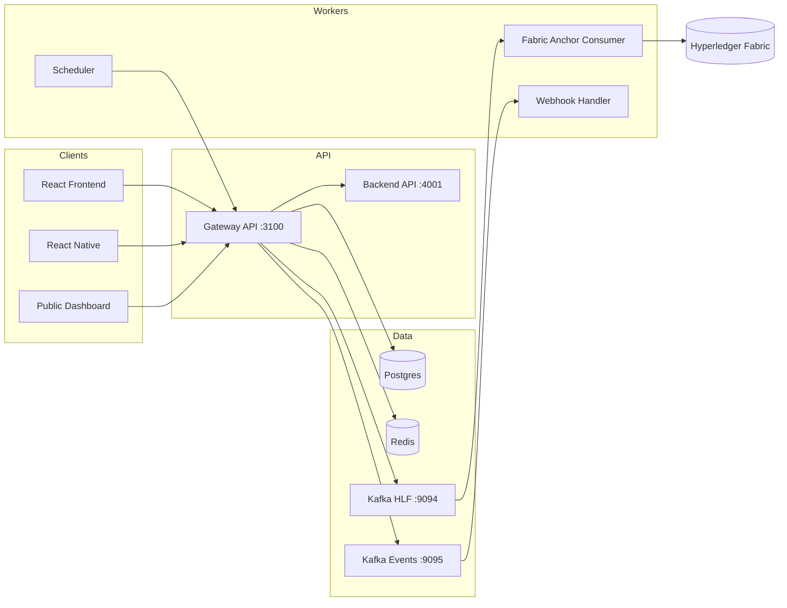

# RoadWatch

**Immutable accountability for every road complaint.**

RoadWatch is a blockchain-enabled citizen complaint platform for road infrastructure — from GPS-tagged filings and authority workflows to SLA escalation, RTI support, and Merkle-anchored audit trails on Hyperledger Fabric.

[](https://nodejs.org/)
[](https://pnpm.io/)
[](https://www.typescriptlang.org/)
[](https://www.hyperledger.org/use/fabric)
[](./CONTRIBUTING.md)

---

## Why RoadWatch

| Capability | What you get |
|------------|--------------|
| **Citizen filing** | Web + mobile complaints with media, location, and tracking tokens |
| **Authority workflows** | Acknowledge, assign, resolve, and escalate with role-based access |
| **SLA & notifications** | Scheduler-driven deadlines, Kafka events, real-time SSE updates |
| **RTI & analytics** | Right-to-Information flows plus public and jurisdiction dashboards |
| **Immutable audit** | Postgres as source of truth; Fabric stores Merkle anchors, not full payloads |
| **AI assist** | Role-aware drafting and summaries via the gateway agent |

---

## Quick start

**Prerequisites:** Node.js 20+, pnpm 8.10+, Docker. See [full prerequisites](./docs/getting-started/prerequisites.md) (includes **Arch Linux**).

```bash
pnpm install
pnpm setup                 # env files + tool checks (Linux/macOS/Windows)
docker compose up -d       # or: pnpm infra:up
pnpm seed:demo
pnpm start:all             # or: pnpm dev
```

| Surface | URL |
|---------|-----|
| Frontend | http://127.0.0.1:5173 |
| Gateway API | http://127.0.0.1:3100 |
| Public dashboard | http://127.0.0.1:5173/public |

**Demo login:** `super.admin.01` / `RoadWatch@123`  
Full role list: [test credentials](./docs/reference/test-credentials.md).

Stop local background services: `pnpm stop:all`

---

## Architecture



**Design principles**

1. **Postgres is the source of truth** — Fabric anchors Merkle roots and audit metadata.
2. **Dual Kafka** — HLF cluster for backpressure; Events cluster for notifications and SLA.
3. **Transactional outbox** — Complaint writes and event enqueue share one DB transaction.
4. **Country adapters** — India-specific RTI / NHAI / PWD rules live in `packages/adapters`.

---

## Monorepo map

```
apps/           gateway-api, mobile-host
backend-api/    Internal data API
frontend/       React web (citizen, authority, contractor, public)
services/       scheduler · webhook-handler · fabric-anchor-consumer · media-ingest
packages/       core · kafka · redis · adapters · features · config
fabric/         Network config & chaincodes (roadwatch-india)
k8s/            Layered Kubernetes manifests
ops/            Dev bootstrap & deploy scripts
docs/           Canonical documentation
```

---

## Key commands

```bash
pnpm setup                # Bootstrap (bash on Linux, pwsh on Windows)
pnpm start:all            # Infra + apps
pnpm stop:all             # Stop local background services
pnpm dev                  # All Node apps (Turbo)
pnpm dev:api              # Gateway only
pnpm test                 # Full test suite
pnpm fabric:start         # Fabric network (native Linux / WSL on Windows)
pnpm deploy:kind          # Local Kubernetes (kind) — still PowerShell today
pnpm infra:up             # Docker Compose only
pnpm infra:down           # Stop Compose stack
```

More: [scripts and commands](./docs/development/scripts-and-commands.md).

---

## Documentation

| I want to… | Go here |
|------------|---------|
| Set up locally | [Getting started](./docs/getting-started/setup.md) |
| Understand the system | [Architecture overview](./docs/architecture/overview.md) |
| Follow a complaint end-to-end | [Complaint lifecycle](./docs/workflows/complaint-lifecycle.md) |
| Deploy Docker / K8s | [Deployment](./docs/operations/deployment.md) |
| Browse all services | [Services index](./docs/services/README.md) |
| Find every doc | [docs/README.md](./docs/README.md) |

---

## Tech stack

| Layer | Stack |
|-------|-------|
| Apps | React + Vite, React Native, TypeScript |
| API | Gateway + Backend REST services |
| Data | Postgres, Redis, dual Kafka |
| Ledger | Hyperledger Fabric (`complaint-anchor` chaincode) |
| Tooling | pnpm workspaces, Turbo, Docker Compose, kind / K8s |
| AI | Gateway-orchestrated agent (see [AI model card](./AI_MODEL_CARD.md)) |

---

## Contributing

We welcome focused, well-scoped contributions. Read **[CONTRIBUTING.md](./CONTRIBUTING.md)** for setup, style, testing, and PR expectations.

---

## License & security

- Do not commit secrets — use `.env.example` templates only. See [SECRETS.md](./SECRETS.md).
- Demo credentials are for local/dev only; rotate anything used outside this repo.
